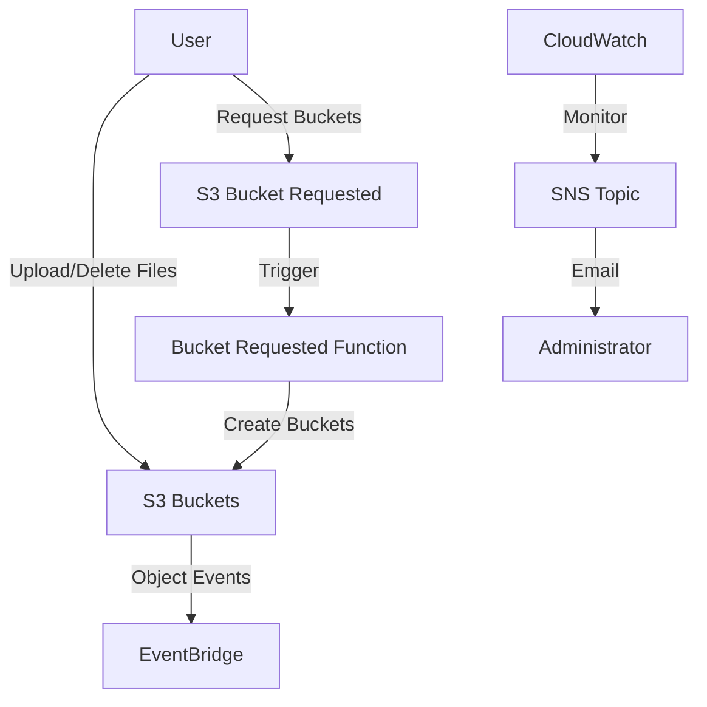
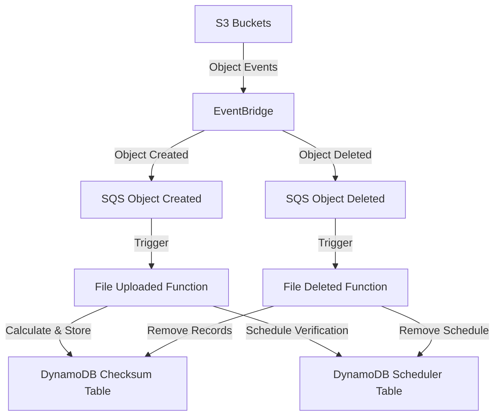
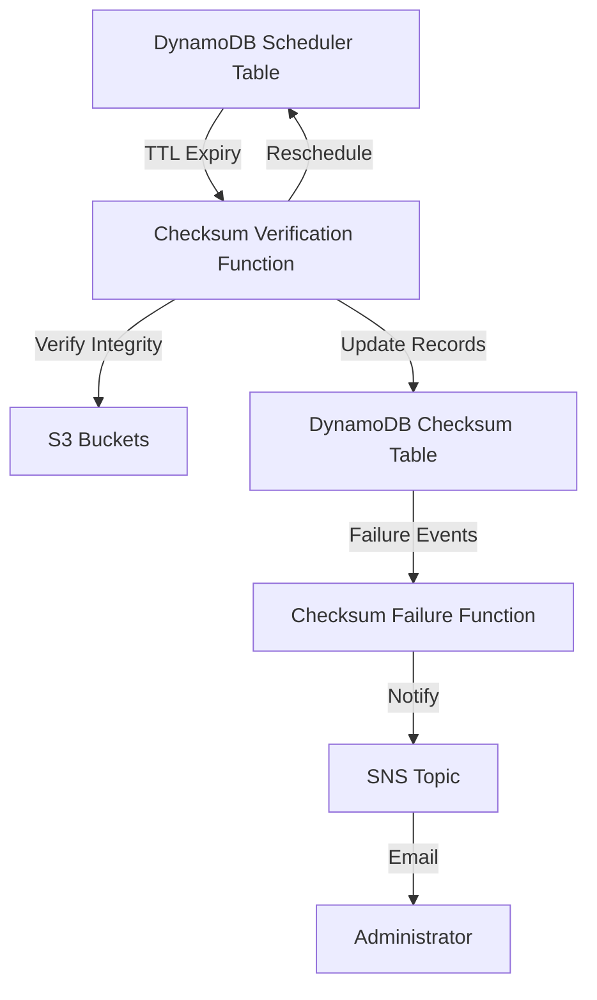
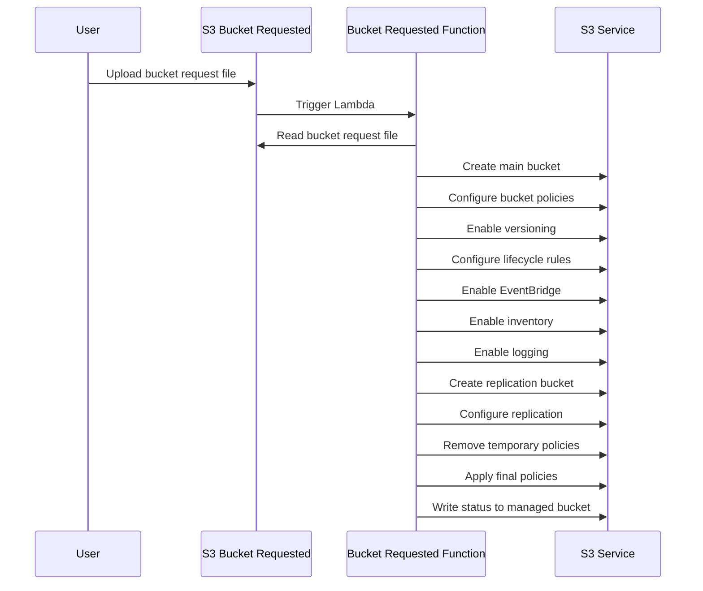
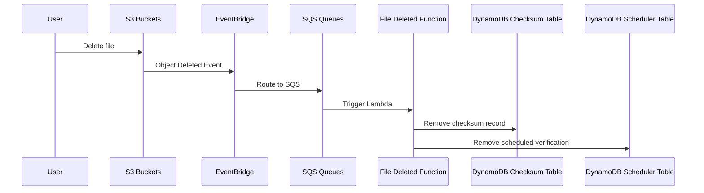
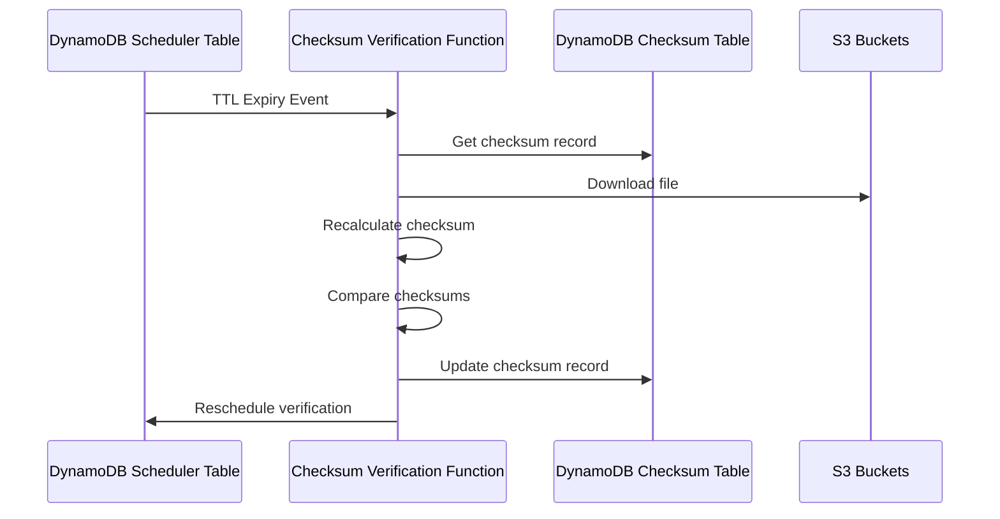
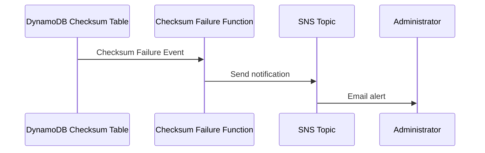

# DuraCloud - Technical Documentation

## Overview

DuraCloud is a serverless application built using AWS SAM (Serverless Application Model) that provides robust file storage management with built-in data integrity verification through checksums. The system automates bucket provisioning, file integrity checks, and provides data protection through replication and versioning.

## Architecture

The application is built using a serverless architecture on AWS with the following key components:

- **Lambda Functions**: Handle various events like file uploads, deletions, and checksum verification
- **S3 Buckets**: Store files and provide event notifications
- **DynamoDB Tables**: Store file checksums and schedule verification tasks
- **SQS Queues**: Buffer events for processing
- **EventBridge**: Route events between services
- **CloudWatch**: Monitor and alert on system health

### System Architecture Diagrams

#### Overall System Architecture



#### File Processing Architecture



#### Verification and Alerting Architecture



## Core Components

### 1. Bucket Management

The bucket management component handles the creation and configuration of S3 buckets based on user requests.

#### Bucket Requested Function

- **Trigger**: S3 event when a file is uploaded to the bucket-requested bucket
- **Purpose**: Creates and configures S3 buckets based on requests
- **Key Features**:
  - Creates main bucket with versioning, lifecycle policies, and EventBridge notifications
  - Creates replication bucket for backup
  - Configures cross-region replication
  - Applies appropriate tags and policies
  - Handles special cases for public buckets
  - Implements rollback functionality if any step fails

#### Workflow



### 2. File Integrity Management

The file integrity management component handles the calculation, storage, and verification of file checksums to ensure data integrity.

#### File Uploaded Function

- **Trigger**: SQS message from EventBridge when an object is created in an S3 bucket
- **Purpose**: Calculates and stores checksums for uploaded files
- **Key Features**:
  - Calculates checksums for uploaded files
  - Compares checksums with S3 ETags for validation
  - Stores checksums in DynamoDB
  - Schedules future verification tasks

#### File Deleted Function

- **Trigger**: SQS message from EventBridge when an object is deleted from an S3 bucket
- **Purpose**: Removes checksum records for deleted files
- **Key Features**:
  - Removes checksum records from DynamoDB
  - Removes scheduled verification tasks

#### Checksum Verification Function

- **Trigger**: DynamoDB TTL expiry events from the scheduler table
- **Purpose**: Verifies file integrity by recalculating checksums
- **Key Features**:
  - Retrieves existing checksum records
  - Recalculates checksums for stored files
  - Compares new checksums with stored values
  - Updates checksum records
  - Reschedules future verification tasks

#### Checksum Failure Function

- **Trigger**: DynamoDB stream events when a checksum verification fails
- **Purpose**: Handles checksum verification failures
- **Key Features**:
  - Notifies administrators of integrity issues
  - Logs failure details

#### Checksum Exporter Function

- **Trigger**: Scheduled EventBridge rule (monthly)
- **Purpose**: Exports DynamoDB checksum table for backup and analysis
- **Key Features**:
  - Exports DynamoDB table to S3
  - Runs on a monthly schedule

#### Workflows

##### File Upload Workflow


##### File Deletion Workflow



##### Checksum Verification Workflow



##### Failure Notification Workflow



### 3. Monitoring and Alerting

The monitoring and alerting component tracks system health and notifies administrators of issues.

#### CloudWatch Alarms

- **Purpose**: Monitor system health and alert on issues
- **Key Features**:
  - Monitors Lambda function errors
  - Monitors DynamoDB capacity consumption
  - Monitors SQS dead-letter queues
  - Sends alerts via SNS

## Data Storage

### DynamoDB Tables

#### Checksum Table

- **Purpose**: Stores file checksums and verification status
- **Key Structure**:
  - Partition Key: BucketName
  - Sort Key: ObjectKey
- **Attributes**:
  - BucketName: S3 bucket name
  - ObjectKey: S3 object key
  - Checksum: Calculated file checksum
  - LastChecksumDate: Timestamp of last verification
  - LastChecksumMessage: Status message
  - LastChecksumSuccess: Boolean indicating success
  - NextChecksumDate: Scheduled next verification

#### Scheduler Table

- **Purpose**: Schedules checksum verification tasks
- **Key Structure**:
  - Partition Key: BucketName
  - Sort Key: ObjectKey
- **Attributes**:
  - BucketName: S3 bucket name
  - ObjectKey: S3 object key
  - TTL: Expiry timestamp for scheduling

### S3 Buckets

#### Managed Bucket

- **Purpose**: Stores system data and logs
- **Key Features**:
  - 30-day lifecycle policy
  - Versioning enabled

#### Bucket Requested Bucket

- **Purpose**: Receives bucket creation requests
- **Key Features**:
  - Triggers Lambda function on file upload
  - EventBridge notifications enabled

#### Logs Bucket

- **Purpose**: Stores system logs
- **Key Features**:
  - Centralized logging repository

## IAM and Security

The system implements a comprehensive security model with:

- **IAM Roles**: Least privilege access for Lambda functions
- **IAM Groups**: S3PowerUsers and S3Users with appropriate permissions
- **Bucket Policies**: Control access to S3 buckets
- **Public Access Blocks**: Prevent unintended public access

## Deployment and Configuration

The application is deployed using AWS SAM with the following parameters:

- **AlertEmailAddress**: Email for alarm notifications
- **LambdaArchitecture**: CPU architecture (arm64 or x86_64)
- **Docker Images**: Optional external Docker images for Lambda functions

## Regenerating This Documentation

To regenerate this technical documentation, you can use the following prompt:

```
Please generate a comprehensive technical documentation for the DuraCloud project.

The documentation should:
1. Provide an overview of the system architecture
2. Describe each component grouped by function (bucket management, file integrity, monitoring)
3. Include detailed information about data storage (DynamoDB tables, S3 buckets)
4. Explain the workflows with sequence diagrams
5. Document the IAM and security model
6. Include mermaid diagrams to visualize the architecture and workflows

Important diagram guidelines:
- Break down complex diagrams into smaller, focused diagrams that each illustrate a specific aspect of the system
- For the system architecture, create separate diagrams for:
  a) Overall system architecture showing main components
  b) File processing architecture
  c) Verification and alerting architecture
- For workflow sequence diagrams, create separate diagrams for each distinct workflow:
  a) File upload workflow
  b) File deletion workflow
  c) Checksum verification workflow
  d) Failure notification workflow
- Keep each diagram focused on a specific aspect to improve readability

Base your analysis on the terraform module and the Lambda function code in the cmd directory.
```

## Conclusion

DuraCloud provides a robust serverless solution for managing file storage with built-in data integrity verification. The system's architecture ensures scalability, reliability, and data durability through automated checksums, replication, and monitoring.
