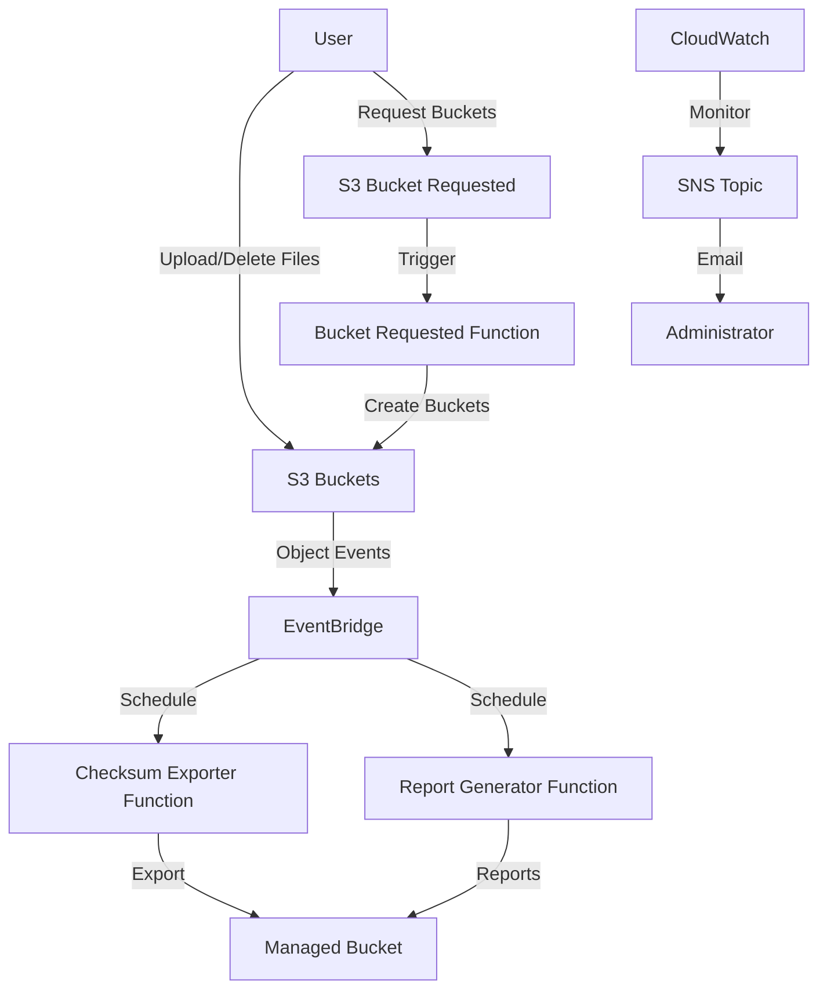
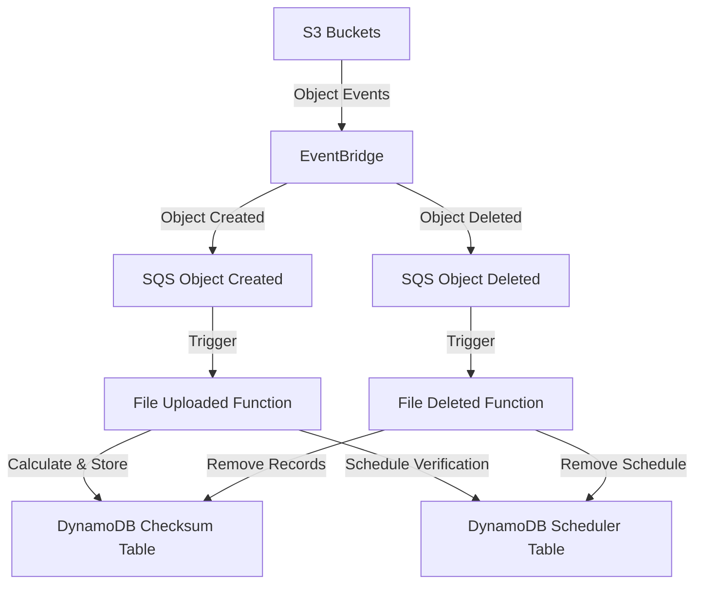
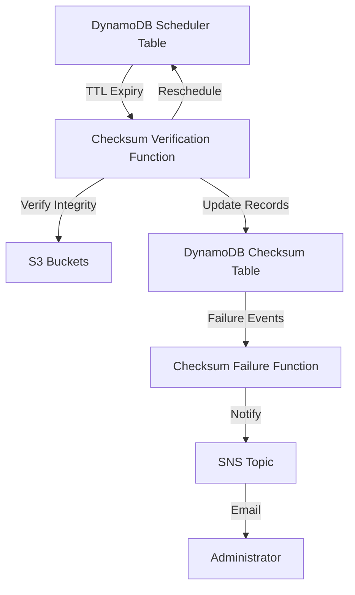
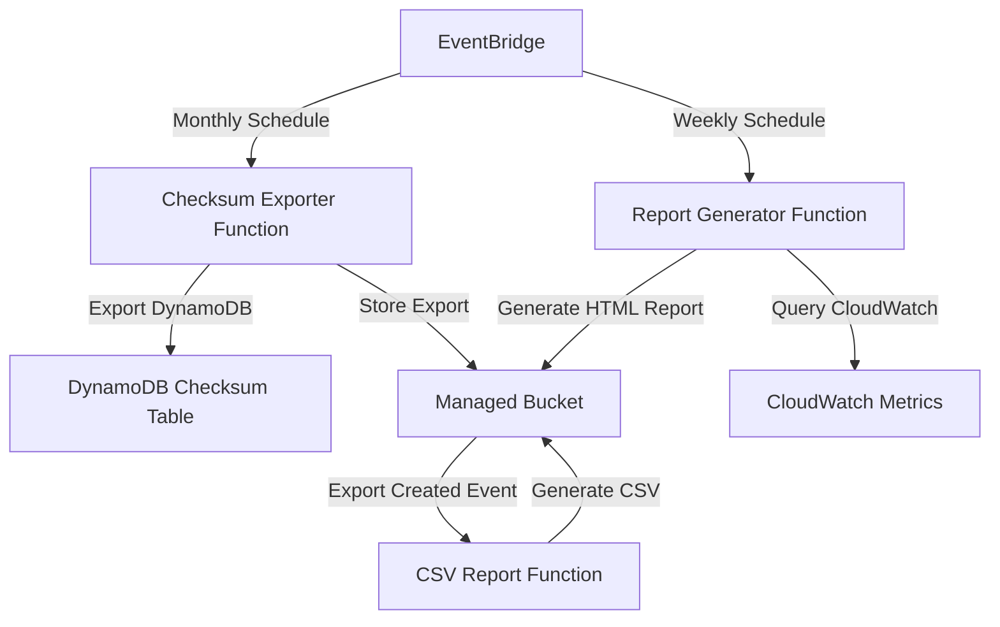
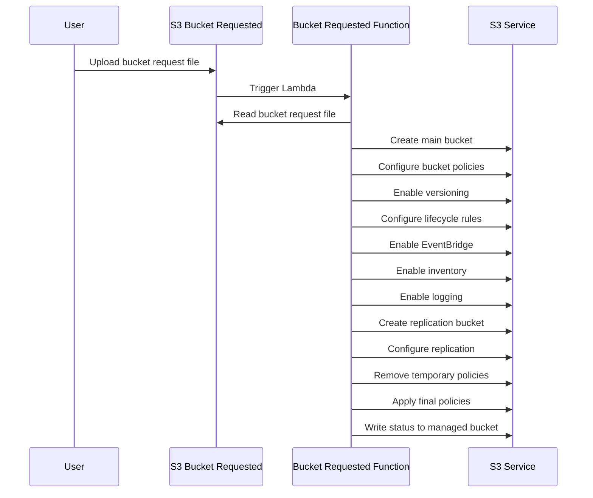
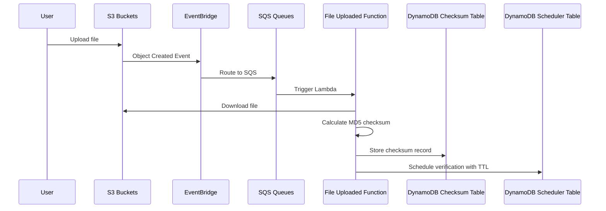
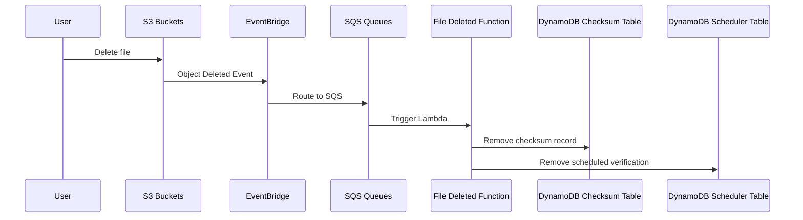
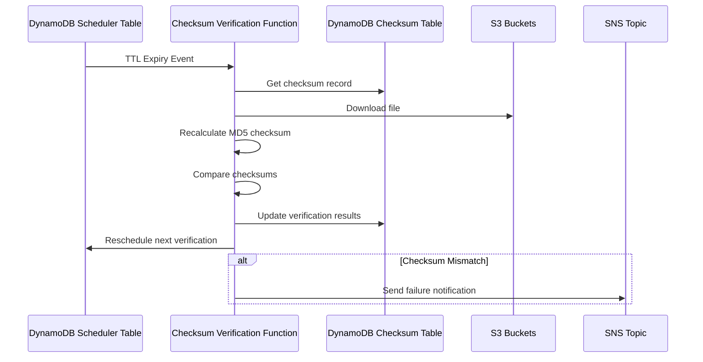
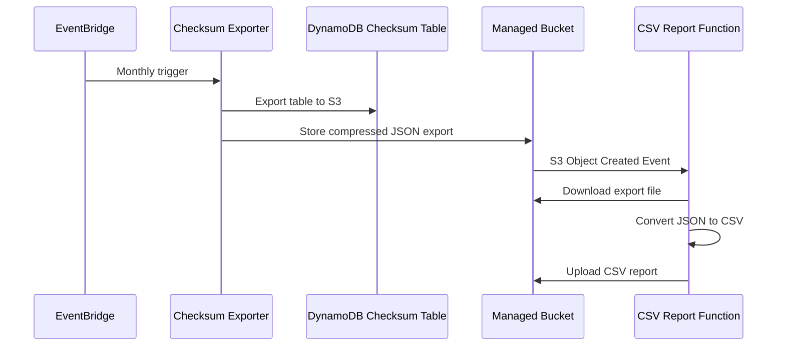
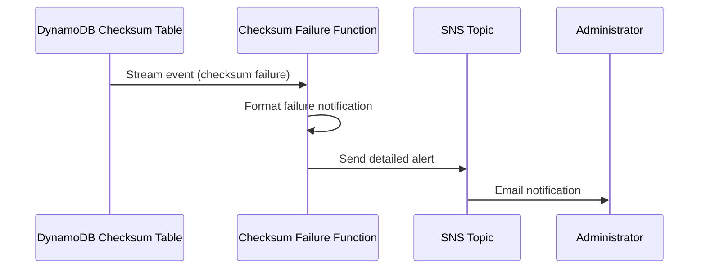

# DuraCloud - Technical Documentation

## Overview

DuraCloud is a set of serverless components built using AWS services centered
around digital preservation uses cases. It provides configuration and features
on top of AWS S3 to support long term access to and preservation of files.

## Architecture

The application is built using a serverless architecture on AWS with the following key components:

- **Lambda Functions**: Handle various events like file uploads, deletions, checksum verification, exports, and reporting
- **S3 Buckets**: Store files and provide event notifications
- **DynamoDB Tables**: Store file checksums and schedule verification tasks
- **SQS Queues**: Buffer events for processing
- **EventBridge**: Route events between services and schedule periodic tasks
- **CloudWatch**: Monitor and alert on system health

### System Architecture Diagrams

#### Overall System Architecture



#### File Processing Architecture



#### Verification and Alerting Architecture



#### Export and Reporting Architecture



## Core Components

### 1. Bucket Management

The bucket management component handles the creation and configuration of S3 buckets based on user requests.

#### Bucket Requested Function (`bucket-requested`)

- **Trigger**: S3 event when a file is uploaded to the bucket-requested bucket
- **Purpose**: Creates and configures S3 buckets based on requests
- **Timeout**: 60 seconds
- **Memory**: 128 MB
- **Key Features**:
  - Creates main bucket with versioning, lifecycle policies, and EventBridge notifications
  - Creates replication bucket for backup (same region)
  - Configures same-region replication with IAM role
  - Applies appropriate tags and policies based on bucket type
  - Handles special cases for public buckets with public access policies
  - Enables inventory configuration for storage analytics
  - Enables access logging for audit purposes
  - Implements comprehensive rollback functionality if any step fails
  - Processes multiple bucket requests concurrently (up to 5 per request)

#### Workflow



### 2. File Integrity Management

The file integrity management component handles the calculation, storage, and verification of file checksums to ensure data integrity.

#### File Uploaded Function (`file-uploaded`)

- **Trigger**: SQS message from EventBridge when an object is created in an S3 bucket
- **Purpose**: Calculates and stores checksums for uploaded files
- **Timeout**: 900 seconds (15 minutes)
- **Memory**: 256 MB
- **Key Features**:
  - Calculates MD5 checksums for uploaded files
  - Compares checksums with S3 ETags for validation
  - Stores checksums and metadata in DynamoDB
  - Schedules future verification tasks via TTL
  - Handles batch processing from SQS

#### File Deleted Function (`file-deleted`)

- **Trigger**: SQS message from EventBridge when an object is deleted from an S3 bucket
- **Purpose**: Removes checksum records for deleted files
- **Timeout**: 60 seconds
- **Memory**: 128 MB
- **Key Features**:
  - Removes checksum records from DynamoDB
  - Removes scheduled verification tasks from scheduler table
  - Handles batch processing from SQS

#### Checksum Verification Function (`checksum-verification`)

- **Trigger**: DynamoDB TTL expiry events from the scheduler table
- **Purpose**: Verifies file integrity by recalculating checksums
- **Timeout**: 900 seconds (15 minutes)
- **Memory**: 256 MB
- **Key Features**:
  - Retrieves existing checksum records
  - Downloads files from S3 and recalculates checksums
  - Compares new checksums with stored values
  - Updates checksum records with verification results
  - Reschedules future verification tasks
  - Sends SNS notifications on verification failures

#### Checksum Failure Function (`checksum-failure`)

- **Trigger**: DynamoDB stream events when a checksum verification fails
- **Purpose**: Handles checksum verification failures
- **Timeout**: 60 seconds
- **Memory**: 128 MB
- **Key Features**:
  - Processes failed checksum verification events
  - Sends detailed failure notifications via SNS
  - Logs failure details for audit purposes
  - Uses email templates for formatted notifications

#### Checksum Exporter Function (`checksum-exporter`)

- **Trigger**: Scheduled EventBridge rule (monthly: `cron(0 8 1 * ? *)`)
- **Purpose**: Exports DynamoDB checksum table for backup and analysis
- **Timeout**: 900 seconds (15 minutes)
- **Memory**: 256 MB
- **Key Features**:
  - Exports entire DynamoDB checksum table to S3
  - Creates timestamped exports in DYNAMODB_JSON format
  - Runs on first day of each month at 8 AM UTC

#### Checksum Export CSV Report Function (`checksum-export-csv-report`)

- **Trigger**: S3 object creation events for DynamoDB export files
- **Purpose**: Converts DynamoDB exports to CSV format for analysis
- **Timeout**: 900 seconds (15 minutes)
- **Memory**: 256 MB
- **Key Features**:
  - Processes DynamoDB export files (.json.gz)
  - Converts JSON records to CSV format
  - Uploads structured CSV reports to S3
  - Handles compressed export data

### 3. Export and Reporting

The export and reporting component provides comprehensive analytics and data export capabilities.

#### Report Generator Function (`report-generator`)

- **Trigger**: Scheduled EventBridge rule (weekly: `cron(0 8 ? * SUN *)`)
- **Purpose**: Generates comprehensive storage analytics reports
- **Timeout**: 900 seconds (15 minutes)
- **Memory**: 256 MB
- **Key Features**:
  - Queries CloudWatch metrics for storage statistics
  - Generates HTML reports with storage analytics
  - Uploads reports to managed bucket with timestamps
  - Runs weekly on Sundays at 8 AM UTC
  - Uses embedded HTML templates for formatting

#### Workflows

##### File Upload Workflow



##### File Deletion Workflow



##### Checksum Verification Workflow



##### Export and CSV Generation Workflow



##### Failure Notification Workflow



### 4. Monitoring and Alerting

The monitoring and alerting component tracks system health and notifies administrators of issues.

#### CloudWatch Alarms

- **Purpose**: Monitor system health and alert on issues
- **Key Features**:
  - Monitors Lambda function errors and timeouts
  - Monitors DynamoDB capacity consumption and throttling
  - Monitors SQS dead-letter queues for failed messages
  - Tracks checksum verification failures
  - Sends alerts via SNS email notifications
  - Provides detailed metrics for storage analytics

## Data Storage

### DynamoDB Tables

#### Checksum Table (`{stack-name}-checksum-table`)

- **Purpose**: Stores file checksums and verification status
- **Billing Mode**: Pay-per-request
- **Key Structure**:
  - Partition Key: BucketName (String)
  - Sort Key: ObjectKey (String)
- **Attributes**:
  - BucketName: S3 bucket name
  - ObjectKey: S3 object key
  - Checksum: Calculated MD5 file checksum
  - LastChecksumDate: Timestamp of last verification
  - LastChecksumMessage: Status message from verification
  - LastChecksumSuccess: Boolean indicating verification success
  - NextChecksumDate: Scheduled next verification timestamp
- **Features**:
  - DynamoDB Streams enabled (NEW_AND_OLD_IMAGES)
  - Point-in-time recovery enabled
  - Stream triggers checksum-failure function on verification failures

#### Scheduler Table (`{stack-name}-checksum-scheduler-table`)

- **Purpose**: Schedules checksum verification tasks using TTL
- **Billing Mode**: Pay-per-request
- **Key Structure**:
  - Partition Key: BucketName (String)
  - Sort Key: ObjectKey (String)
- **Attributes**:
  - BucketName: S3 bucket name
  - ObjectKey: S3 object key
  - TTL: Expiry timestamp for scheduling verification
- **Features**:
  - TTL enabled on TTL attribute
  - DynamoDB Streams enabled (OLD_IMAGE)
  - Point-in-time recovery enabled
  - TTL expiry triggers checksum-verification function

### S3 Buckets

#### Managed Bucket (`{stack-name}-managed`)

- **Purpose**: Stores system data, reports, exports, and audit logs
- **Key Features**:
  - 30-day lifecycle policy for automatic cleanup
  - Versioning enabled with 1-day noncurrent version expiration
  - Receives DynamoDB exports under `exports/` prefix
  - Stores CSV reports converted from exports
  - Stores HTML storage reports under `reports/` prefix
  - Audit logs stored under `audit/` prefix
  - Inventory reports stored under `inventory/` prefix
  - S3 notification triggers CSV report generation for exports

#### Bucket Requested Bucket (`{stack-name}-bucket-requested`)

- **Purpose**: Receives bucket creation requests from users
- **Key Features**:
  - Triggers bucket-requested Lambda function on file upload
  - EventBridge notifications enabled
  - Acts as inbox for bucket provisioning requests
  - Supports batch requests (up to 5 buckets per request)

## IAM and Security

The system implements a comprehensive security model with:

- **IAM Roles**: Least privilege access for each Lambda function with specific permissions
  - Bucket Requested Function: S3 bucket creation, policy management, replication setup
  - File Processing Functions: S3 object access, DynamoDB read/write
  - Export Functions: DynamoDB export permissions, S3 write access
  - Monitoring Functions: SNS publish, CloudWatch metrics access
- **IAM Groups**: S3PowerUsers and S3Users with appropriate bucket access permissions
- **Bucket Policies**: Granular access control for S3 buckets with service-specific permissions
- **S3 Replication Role**: Dedicated IAM role for cross-bucket replication
- **Public Access Blocks**: Prevent unintended public access except for designated public buckets
- **EventBridge-SQS Integration**: IAM role for EventBridge to send messages to SQS queues

## Deployment and Configuration

The application is deployed using Terraform with the following parameters:

- **stack_name**: Stack name prefix for all resources
- **alert_email_address**: Email for alarm notifications (optional)
- **lambda_architecture**: CPU architecture (arm64 or x86_64, default: x86_64)
- **Docker Images**: Configurable Docker images for each Lambda function
  - bucket_requested_image_uri: `docker.io/duracloud/bucket-requested:latest`
  - checksum_exporter_image_uri: `docker.io/duracloud/checksum-exporter:latest`
  - checksum_export_csv_report_image_uri: `docker.io/duracloud/checksum-export-csv-report:latest`
  - checksum_failure_image_uri: `docker.io/duracloud/checksum-failure:latest`
  - checksum_verification_image_uri: `docker.io/duracloud/checksum-verification:latest`
  - file_deleted_image_uri: `docker.io/duracloud/file-deleted:latest`
  - file_uploaded_image_uri: `docker.io/duracloud/file-uploaded:latest`
  - report_generator_image_uri: `docker.io/duracloud/report-generator:latest`
- **Scheduling**:
  - checksum_exporter_schedule: `cron(0 8 1 * ? *)` (monthly on 1st at 8 AM UTC)
  - report_generator_schedule: `cron(0 8 ? * SUN *)` (weekly on Sundays at 8 AM UTC)

## Regenerating This Documentation

To regenerate this technical documentation, you can use the following prompt:

```
Please generate a comprehensive technical documentation for the DuraCloud project.

The documentation should:
1. Provide an overview of the system architecture
2. Describe each component grouped by function (bucket management, file integrity, monitoring)
3. Include detailed information about data storage (DynamoDB tables, S3 buckets)
4. Explain the workflows with sequence diagrams
5. Document the IAM and security model
6. Include mermaid diagrams to visualize the architecture and workflows

Important diagram guidelines:
- Break down complex diagrams into smaller, focused diagrams that each illustrate a specific aspect of the system
- For the system architecture, create separate diagrams for:
  a) Overall system architecture showing main components
  b) File processing architecture
  c) Verification and alerting architecture
- For workflow sequence diagrams, create separate diagrams for each distinct workflow:
  a) File upload workflow
  b) File deletion workflow
  c) Checksum verification workflow
  d) Failure notification workflow
- Keep each diagram focused on a specific aspect to improve readability

Base your analysis on the terraform module and the Lambda function code in the cmd directory and update for any additional functions that may have been added.

Ignore the docs-src directory if it exists.
```

## Conclusion

DuraCloud provides a robust serverless solution for managing file storage with built-in data integrity verification. The system's architecture ensures scalability, reliability, and data durability through automated checksums, replication, and monitoring.
